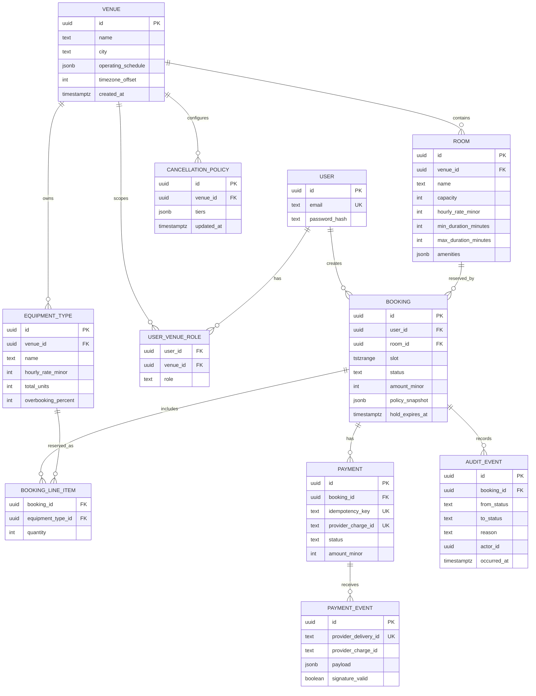
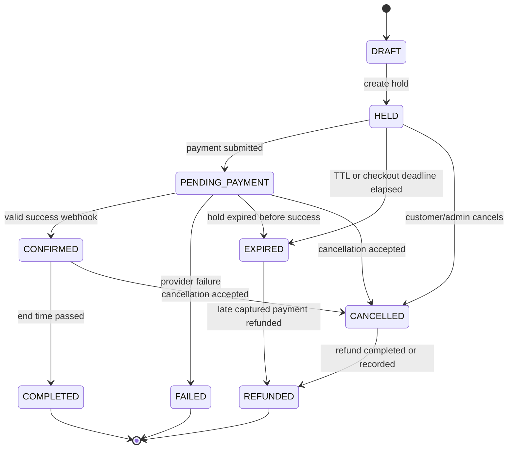

# Atrium Studio Booking Platform Architecture

## 1. Scope and Technology Choice

Atrium is a multi-venue booking system for time-based rooms and quantity-based
equipment. Correctness under concurrent requests and unreliable payment delivery
has priority over Tier 2 and Tier 3 feature breadth.

| Layer | Choice | Responsibility |
| --- | --- | --- |
| Web client | React | Search, availability, checkout, staff/admin workflows |
| API | Node.js + Express | Authentication, authorization, validation, application services |
| Database | Neon PostgreSQL | Source of truth, transactions, exclusion constraints, reporting |
| ORM | Prisma ORM and Prisma Client | Typed models, migrations, transactions, and ordinary CRUD |
| Database-specific SQL | Prisma migrations and tagged `$queryRaw` queries | Range constraints, GiST indexes, interval sweeps, and row locks |
| Jobs | PostgreSQL-backed polling loops | Hold expiry, booking completion, and pending refund retries |
| Deployment | Three stateless Express replicas behind a load balancer | Horizontal request handling |

I chose Express and React because they are familiar, widely deployable, and
keep the API and browser concerns separate. Neon provides managed PostgreSQL
without changing the relational correctness model. Prisma is used for the
application's typed data access and migration workflow, while PostgreSQL
features that Prisma does not model directly remain explicit in SQL migrations
and narrowly scoped tagged raw queries. PostgreSQL is the important choice:
its range types, exclusion constraints, row locks, unique constraints, and
transaction isolation provide database-enforced guarantees that application
memory cannot provide across three API processes. A document database was
rejected because interval exclusion and transactional quantity reservations are
central to this domain; the accepted trade-off is relational modeling and
migrations. A query builder without a typed schema was rejected because it
would provide less compile-time protection for the many booking relationships;
the accepted Prisma trade-off is that advanced PostgreSQL constructs need
reviewed SQL alongside the Prisma schema.

Neon connection strings are kept in environment variables and are never sent
to React. Stateless Express replicas use Neon's pooled connection endpoint for
short web requests. The worker uses a separate appropriately sized pool, and
Prisma's transaction timeout and connection wait timeout are configured below
the load balancer timeout. Long reports run through a controlled read path and
are not mixed into the booking transaction pool. Schema changes are applied by
`prisma migrate deploy` during deployment, while local development and CI use a
disposable Neon branch or PostgreSQL database.

The React application never decides availability, price, role access, booking
state, or refund amount. It displays API results and treats a `409 Conflict` as
a normal race outcome.

## 2. Entity Relationship Diagram



Important constraints include foreign keys, positive quantities, non-negative
prices and unit counts, role checks, and a unique `(booking_id,
equipment_type_id)` line item. Money is stored as integer minor units with an
explicit currency; no floating point values are used for charges.

## 3. Booking State Machine



Every transition is made through one booking state-machine service. The service
locks the booking row, verifies the current state and transition reason, and
writes exactly one append-only `AuditEvent` in the same transaction. Illegal
transitions return `409 Conflict`; controllers never issue arbitrary status
updates. Terminal states cannot transition again except the explicit late-
payment `EXPIRED -> REFUNDED` path.

## 4. Concurrency Strategy

### Rooms

PostgreSQL stores each interval as a half-open `tstzrange`, `[start, end)`, in
the venue's canonical timezone converted to UTC. A partial exclusion constraint
protects active inventory:

```sql
EXCLUDE USING gist (
  room_id WITH =,
  slot WITH &&
) WHERE (status IN ('HELD', 'PENDING_PAYMENT', 'CONFIRMED'))
```

The `btree_gist` extension supports UUID equality in the GiST constraint. The
15-minute room turnaround is represented by expanding the protected interval
by 15 minutes on the appropriate side, while the customer-facing slot remains
the requested interval. The hold transaction inserts the booking and its line
items; a concurrent conflicting insert fails with PostgreSQL exclusion error
`23P01`, which the API maps to `409 Conflict`.

### Equipment

Equipment overlaps partially, so a total counter is insufficient. In one
PostgreSQL transaction, the hold service:

1. Locks the requested `equipment_type` rows in stable UUID order with
   `SELECT ... FOR UPDATE`.
2. Validates the booking interval, quantity, and effective capacity, including
   the configured maximum 10% overbooking buffer.
3. Runs an interval sweep over active line items for that equipment type. Each
   start contributes `+quantity` and each end contributes `-quantity`; the
   maximum simultaneous sum must not exceed capacity.
4. Inserts the booking and line items before committing.

The row lock serializes all reservations for a given equipment type across all
Express replicas. The transaction rechecks after waiting for the lock, so a
check-then-insert race cannot oversell. Requests for different equipment types
remain parallel. Locking all requested types in sorted order avoids deadlocks
between multi-equipment bookings. A failed capacity check returns `409`.

### Three replicas and expiry

No mutex, cache, or process-local reservation state is used. All three API
replicas connect to the same PostgreSQL database and therefore observe the same
exclusion constraint and row locks. Expiry is also database-driven: workers
claim due holds with `FOR UPDATE SKIP LOCKED` in the same transaction as the
explicit `HELD -> EXPIRED` transition and audit insert. The worker is safe to
run on multiple replicas.

The required concurrency proof sends 200 simultaneous requests to the same
room and one-hour interval. PostgreSQL permits exactly one active room booking;
the remaining requests receive `409`. The same transaction strategy permits no
more than three simultaneous units when the equipment capacity is three. The
proof must run through the load balancer, not directly against one process.

### Verified runtime evidence (2026-08-25)

The Compose configuration validated successfully. The shared PostgreSQL
container, three API replicas, and Nginx were all running and healthy. Thirty
requests through Nginx returned HTTP 200 and distributed evenly across the
replicas: `api-1` 10, `api-2` 10, and `api-3` 10. Each response reported
PostgreSQL and Paygate dependencies as healthy. The `btree_gist` extension and
`audit_events_append_only` trigger were present in PostgreSQL.

The mandatory proof was executed through Nginx on the local Compose stack with
three healthy API replicas and a clean demo seed. The exact test output was:

```text
Room proof counts { successes: 1, conflicts: 199, unexpected: 0, samples: [] }
Equipment proof counts { successes: 3, conflicts: 197, unexpected: 0, samples: '[]' }
Test Suites: 1 passed, 1 total
Tests:       2 passed, 2 total
```

No duplicate active room bookings or equipment over-allocation occurred. The
tenant-isolation negative test passed, including direct access to valid resource
UUIDs in another venue. The payment integrity suite passed 10/10.

The Paygate chaos burst was executed with `PAYGATE_CHAOS=on`, but remains
unverified because an earlier 100-attempt run produced Nginx `502` responses
and one retried `500`. Load-test measurements and `EXPLAIN ANALYZE` captures
remain unverified.

## 5. Validation and Booking Rules

The Express service validates UUIDs, authenticated identity, role, venue scope,
ISO timestamps, UTC-normalized ranges, 30-minute boundaries, one-to-eight-hour
duration, one-hour-to-90-day advance window, and positive equipment quantities.
It checks the venue's weekly operating schedule and local holiday/closed-day
configuration before opening the database transaction. The database transaction
rechecks all values that affect correctness.

Pricing is calculated server-side. A confirmed booking stores the final amount,
currency, cancellation policy snapshot, and rate inputs. A later venue policy
or price change therefore cannot alter an existing confirmed booking.

## 6. API, React, and Authorization Boundaries

Representative API boundaries are:

| Method | Endpoint | Purpose |
| --- | --- | --- |
| `POST` | `/api/auth/login` | Email/password login, JWT |
| `GET` | `/api/auth/me` | Current user and venue roles |
| `GET` | `/api/venues/search` | Combined city, capacity, amenities, price, and availability search |
| `GET` | `/api/rooms/:id/availability` | Availability for a window of at most seven days |
| `GET` | `/api/venues/:venueId/equipment` | Equipment types for optional hold line items |
| `GET` | `/api/venues/:venueId/cancellation-policy` | Active refund tiers (data, not code) |
| `PUT` | `/api/venues/:venueId/cancellation-policy` | Venue admin replaces active tiers; old versions stay for history |
| `POST` | `/api/bookings/holds` | Atomic room and equipment hold |
| `POST` | `/api/bookings/:id/checkout` | Grant a 10-minute checkout window; may extend the 8-minute hold |
| `POST` | `/api/bookings/:id/payment` | Submit one Paygate charge attempt |
| `POST` | `/api/paygate/webhook` | Verify signature, persist event, apply payment effect |
| `POST` | `/api/bookings/:id/cancel` | Apply policy snapshot and create idempotent refunds |
| `GET` | `/api/bookings` | Tenant-scoped booking list |
| `GET` | `/api/bookings/:id` | Booking detail |
| `GET` | `/api/reports/reconciliation` | Captures, bookings, refunds, and discrepancies |
| `GET` | `/api/reports/revenue` | Venue-scoped revenue and utilization |
| `GET` | `/health` | Database and Paygate persistence health |

Express middleware authenticates a short-lived token, loads the role and venue
scope from PostgreSQL, and performs authorization again inside the service
using the target resource's venue. A `VENUE_ADMIN` from Venue A cannot access a
known valid UUID belonging to Venue B, even if the frontend is bypassed; the
API returns `404` for resource reads where existence should not be disclosed
and `403` for authenticated forbidden actions. `CUSTOMER` access is limited to
their own bookings. `VENUE_STAFF` can manage bookings for their assigned venue,
while `VENUE_ADMIN` manages that venue's inventory, staff, prices, and policy.
`PLATFORM_ADMIN` is unrestricted.

React routes are thin views over these APIs. Forms disable duplicate submission
using a client request key, but server idempotency and authorization remain
authoritative. Error responses include a correlation ID for support and logs.

## 7. Payment Integrity Model

Paygate is treated as an at-least-once, out-of-order system of record for charge
attempt results, not as a reliable request/response dependency.

1. The payment service creates one `Payment` row with a unique booking ID and
   client idempotency key before calling Paygate. The charge amount is copied
   from the booking snapshot.
2. The outbound request uses a stable idempotency key. A timeout or `500` is
   retried with the same key, never a new charge key.
3. The webhook verifies the HMAC over the raw request body before parsing. An
   invalid signature returns `401`, is logged, and is not processed.
4. Valid events are stored in `payment_events` using the provider delivery ID
  as a deduplication key. An unknown charge is recorded and acknowledged; it is
  not silently dropped or turned into a `500`.
5. The webhook request currently locks the payment and booking, applies the
  event, and commits the booking transition plus audit event atomically.
  Duplicate deliveries and stale out-of-order events have no second business
  effect. Events are persisted even when stale. The payment row is locked
  before comparing events; a successful capture is terminal over failures, and
  timestamped events older than the latest event are ignored.
6. A success received after `HELD` has expired cannot confirm the booking. The
  handler records the captured charge, creates a recoverable pending refund,
  and submits one refund with a deterministic refund idempotency key.

The legal provider-event progression is `PROCESSING -> SUCCEEDED` or
`PROCESSING -> FAILED`; a later authoritative `FAILED -> SUCCEEDED` is also
accepted and follows the normal confirmation or late-refund path. Duplicate
delivery IDs are ignored. A `SUCCEEDED -> FAILED` event is ignored because a
captured payment is terminal, as is a timestamped event older than the latest
accepted event. Duplicate failures create no second booking transition. These
rules preserve captured-money recovery without allowing arbitrary state
regressions.

The unique constraints on payment booking/attempt, provider charge ID, event
delivery ID, and refund idempotency key provide database enforcement. The
reconciliation report compares every captured charge with exactly one confirmed
booking or exactly one refund, checks amount and currency, and lists unknown,
duplicated, missing, or mismatched records. A non-zero discrepancy makes the
report unhealthy and triggers an operational alert.

## 8. Cancellation and Refunds

Cancellation tiers are data in `cancellation_policies`, editable by a scoped
venue admin. At cancellation time the service calculates room and equipment
refund percentages separately from the stored policy snapshot and current UTC
time relative to the booking start. Confirmed bookings retain their original
policy snapshot; changing a policy affects new bookings immediately but is not
retroactive.

The refund operation locks the booking and payment, verifies that cancellation
is legal, calculates the refund in integer minor units, and uses a stable key
`refund:{booking_id}:{amount_minor}`. Repeated cancellation requests or webhook
retries therefore create at most one provider refund. A completed refund and
its audit event are committed together.

## 9. Search, Indexing, and Performance

The primary search query starts with venue filters and joins rooms to venues.
Availability is expressed as a range anti-join against active bookings, not by
loading rows into Express:

```sql
SELECT r.id, r.venue_id, r.capacity, r.hourly_rate_minor
FROM rooms r
JOIN venues v ON v.id = r.venue_id
WHERE v.city = $1
  AND r.capacity >= $2
  AND r.hourly_rate_minor <= $3
  AND r.amenities @> $4::jsonb
  AND NOT EXISTS (
    SELECT 1 FROM bookings b
    WHERE b.room_id = r.id
      AND b.status IN ('HELD', 'PENDING_PAYMENT', 'CONFIRMED')
      AND b.slot && tstzrange($5, $6, '[)')
  );
```

Planned indexes are:

```sql
CREATE INDEX venues_city_idx ON venues (city);
CREATE INDEX rooms_venue_capacity_price_idx
  ON rooms (venue_id, capacity, hourly_rate_minor);
CREATE INDEX rooms_amenities_gin_idx ON rooms USING gin (amenities);
CREATE INDEX bookings_room_active_gist_idx ON bookings USING gist (room_id, slot)
  WHERE status IN ('HELD', 'PENDING_PAYMENT', 'CONFIRMED');
CREATE INDEX bookings_status_hold_expiry_idx ON bookings (hold_expires_at)
  WHERE status = 'HELD';
CREATE INDEX bookings_venue_start_idx ON bookings (room_id, lower(slot));
CREATE INDEX line_items_equipment_idx ON booking_line_items (equipment_type_id, booking_id);
```

The final submission will include `EXPLAIN (ANALYZE, BUFFERS)` for the full
profile before and after these indexes in `LOAD_TEST.md`, alongside p50, p95,
p99, error rate, and machine details. The target is under 300 ms p95 for
seven-day availability, under 500 ms for combined cross-venue search, under
250 ms for holds, and under 800 ms for a 30-day revenue report. Reports use
date-range predicates and grouped indexed booking data; expensive work is not
performed in the webhook request.

## 10. Observability and Failure Handling

Every request receives or propagates an `X-Request-ID`. The ID is persisted on
audit/payment events and passed into queued webhook work. Structured JSON logs
include request ID, actor ID, venue ID, booking ID, provider charge ID,
transition, latency, and database error code. Sensitive payment payloads and
credentials are redacted.

`/health` checks PostgreSQL connectivity and Paygate persistence. Hold expiry,
booking completion, and pending-refund retry loops run in each API process using
database locking. Webhook signature verification and payment transitions are
currently performed inline; `payment_events` and pending refunds remain
durable and queryable for retry/reconciliation.

## 11. Assumptions

- All persisted timestamps are UTC; venue schedules are evaluated in the
  venue's IANA timezone before conversion to UTC.
- Slots are half-open, so a booking ending at 13:00 does not overlap one
  starting at 13:00, except for the room's explicit 15-minute turnaround.
- The 10% overbooking setting may apply to any inventory type, including rooms
  and equipment, and is rounded down to a whole unit where quantity applies; it
  never removes the assessment's requirement to enforce inventory limits.
- The ten-minute checkout window is represented by a checkout deadline that is
  at least ten minutes from checkout creation (`POST /api/bookings/:id/checkout`).
  It may extend the eight-minute initial hold, but never shortens an already
  granted payment window. Holds that never reach checkout expire at eight minutes.
- Inventory and policy edits affect future holds. Existing confirmed bookings
  use their stored price and policy snapshots. Venue admins replace policy via
  `PUT /api/venues/:venueId/cancellation-policy`, which inserts a new version
  and deactivates the previous active row.
- Paygate's successful charge is considered captured only from a valid signed
  success event; a `202 processing` response alone never confirms a booking.
- Unknown provider events remain queryable until reconciliation resolves them.
- Health is exposed at `GET /health` (not `/api/health`).
- Webhook handling verifies the HMAC, writes `payment_events`, then applies the
  booking/payment transition before returning. That is still one request; the
  durable event row is what makes duplicate delivery safe. A fully asynchronous
  webhook queue is not implemented.

## 12. What Breaks at 100x

At 25 million bookings, the first pressure points are index and table size,
reporting scans, and queue/webhook volume. The response is to partition
bookings by time and/or venue while keeping the active interval constraints in
the correct partition, move historical events and audit data to cheaper
append-only storage, and add read replicas or pre-aggregated reporting tables.
Search can be supported by a dedicated search index only as a read optimization;
PostgreSQL remains authoritative for final availability and holds. Payment
workers would be scaled horizontally with queue sharding and provider rate
limits, while idempotency keys remain globally unique.

## 13. Delivery Order and Proof Obligations

The build order is: architecture and concurrency proof design; schema and
state-machine tests; auth and tenant-negative tests; atomic hold path; Paygate
and payment tests; cancellation/reconciliation; deployment with three API
replicas; full-profile seed and load benchmark; then Tier 2/3 features.

The minimum acceptance suite includes state transition unit tests, refund
calculator tests, the valid-UUID cross-venue authorization test, an end-to-end
happy path, and the 200-request three-replica concurrency proof. Tier 3 live
heatmap, natural-language search, recurring bookings, waitlist promotion, and
notifications are deliberately deferred until Tier 1 invariants are proven.
